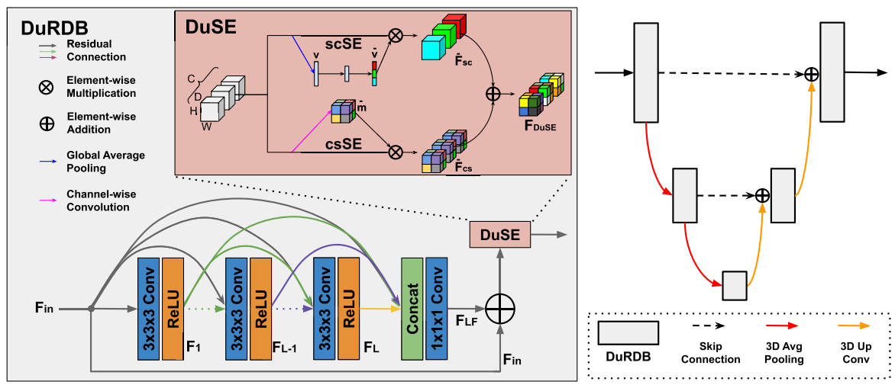

# CT-free attenuation correction for dedicated cardiac SPECT using a 3D dual squeeze-and-excitation residual dense network

Xiongchao Chen, Bo Zhou, Luyao Shi, Hui Liu, Yulei Pang, Rui Wang, Edward J Miller, Albert J Sinusas, Chi Liu

Journal of Nuclear Cardiology. 2021 Jun 3:1-6.



[[Paper](https://link.springer.com/content/pdf/10.1007/s12350-021-02672-0.pdf)]

This repository contains the PyTorch implementation of DuRDN.

### Citation
If you use this code for your research or project, please cite:

        @article{chen2021ct,
          title={CT-free attenuation correction for dedicated cardiac SPECT using a 3D dual squeeze-and-excitation residual dense network},
          author={Chen, Xiongchao and Zhou, Bo and Shi, Luyao and Liu, Hui and Pang, Yulei and Wang, Rui and Miller, Edward J and Sinusas, Albert J and Liu, Chi},
          journal={Journal of Nuclear Cardiology},
          pages={1--16},
          year={2021},
          publisher={Springer}
        }
 
 ### Environment and Dependencies
 Requirements:
 * Python 3.6.10
 * Pytorch 1.2.0
 * numpy 1.19.2
 * scipy
 * scikit-image
 * h5py
 * tqdm
 
 Our code has been tested with Python 3.6.10, Pytorch 1.2.0, CUDA: 10.0.130 on Ubuntu 18.04.6.
 
 ### Dataset Setup
    .
    Data
    ├── train                # contain training files
    |   ├── data1.h5
    |       ├── AC.mat  
    |       ├── NC.mat
    |       ├── SC.mat
    |       ├── SC2.mat
    |       ├── SC3.mat
    |       ├── GD.mat
    |       ├── BMI.mat
    |       ├── STATE.mat
    |   └── ...  
    |
    ├── valid                # contain validation files
    |   ├── data1.h5
    |       ├── AC.mat  
    |       ├── NC.mat
    |       ├── SC.mat
    |       ├── SC2.mat
    |       ├── SC3.mat
    |       ├── GD.mat
    |       ├── BMI.mat
    |       ├── STATE.mat
    |   └── ... 
    |
    └── test                 # contain testing files
        ├── data1.h5
            ├── AC.mat  
            ├── NC.mat
            ├── SC.mat
            ├── SC2.mat
            ├── SC3.mat
            ├── GD.mat
            ├── BMI.mat
            ├── STATE.mat
        └── ... 

Each .mat should contain a H x W x H float value matrix. 
`AC`: Attenuation-corrected image. \
`NC`: Non-attenuation-corrected image. \
`SC`: The 1st Scatter-window image. \
`SC2`: The 2nd Scatter-window image. \
`SC3`: The 3rd Scatter-window image. \
`GD`: Gender encoding volume (0/1). \
`BMI`: BMI value volume. \
`State`: Stress/rest value volume (0/1). 

### To Run the Code
- Train the model 
```bash
python train.py --experiment_name 'train_DuRDN' --model_type 'model_cnn' --data_root '../../Data/Dataset_filename/' --net_G 'DuRDN' --batch_size 2 --n_patch_train 1 --patch_size_train 32 32 32 --eval_epochs 10 --save_epochs 10 --patch_size_eval 32 32 32 --lr 5e-4 --norm 'BN' --norm_pred_AC --use_scatter --use_scatter2 --use_scatter3 --use_gender --use_bmi --use_state --gpu_ids 0
```

where \
`--experiment_name` experiment name for the code, and save all the training results in this under this "experiment_name" folder. \
`--model_type`: model type used (default convolutioanl neural networks -- "model_cnn"). \
`--data_root`: path of the dataset. \
`--net_G`: neural network model used (default: 'DuRDN'). \
`--batch_size`: training batch size. \
`--n_patch_train`: number of patches extracted from each image volume. \
`--patch_size_train`: training patch size. \
`--eval_epochs`: number of epoches for periodic validation. \
`--save_epochs`: number of epoches for saving trained model. \
`--patch_size_eval`: validation patch size. \
`--lr`: learning rate. \
`--norm`: normalization of convolutioanl layers in the networks. \
`--norm_pred_AC`: mean normalization of the predicted images before testing. \
`--use_scatter`: adding the 1st scatter-window image to input. \
`--use_scatter2`: adding the 2nd scatter-window image to input. \
`--use_scatter3`: adding the 3rd scatter-window image to input. \
`--use_gender`: adding gender volume to input. \
`--use_bmi`: adding BMI volume to input . \
`--use_state`: adding stress/rest volume to input. \
`--gpu_ids`: GPU configuration.

- Test the model \
```bash
python test.py --resume './outputs/train_DuRDN/checkpoints/model_999.pt' --resume_epoch 999 --experiment_name 'test_DuRDN_999' --model_type 'model_cnn' --data_root '../../Data/Dataset_filename' --net_G 'DuRDN' --patch_size_eval 32 32 32 --lr 5e-4 --norm 'BN' --norm_pred_AC --use_scatter --use_scatter2 --use_scatter3 --use_gender --use_bmi --use_state --gpu_ids 0
```

where \
`resume`: path of the model to be tested
`resume_epoch`: training epoch of the model to be tested
`--experiment_name`: experiment name for the code, and save all the testing results in this under this "experiment_name" folder. \
`--model_type`: model type used (default convolutioanl neural networks -- "model_cnn"). \
`--data_root`: path of the dataset. \
`--net_G`: neural network model used (default: 'DuRDN'). \
`--patch_size_eval`: testing patch size. \
`--lr`: learning rate. \
`--norm`: normalization of convolutioanl layers in the networks. \
`--norm_pred_AC`: mean normalization of the predicted images before testing. \
`--use_scatter`: adding the 1st scatter-window image to input. \
`--use_scatter2`: adding the 2nd scatter-window image to input. \
`--use_scatter3`: adding the 3rd scatter-window image to input. \
`--use_gender`: adding gender volume to input. \
`--use_bmi`: adding BMI volume to input . \
`--use_state`: adding stress/rest volume to input. \
`--gpu_ids`: GPU configuration.

 
